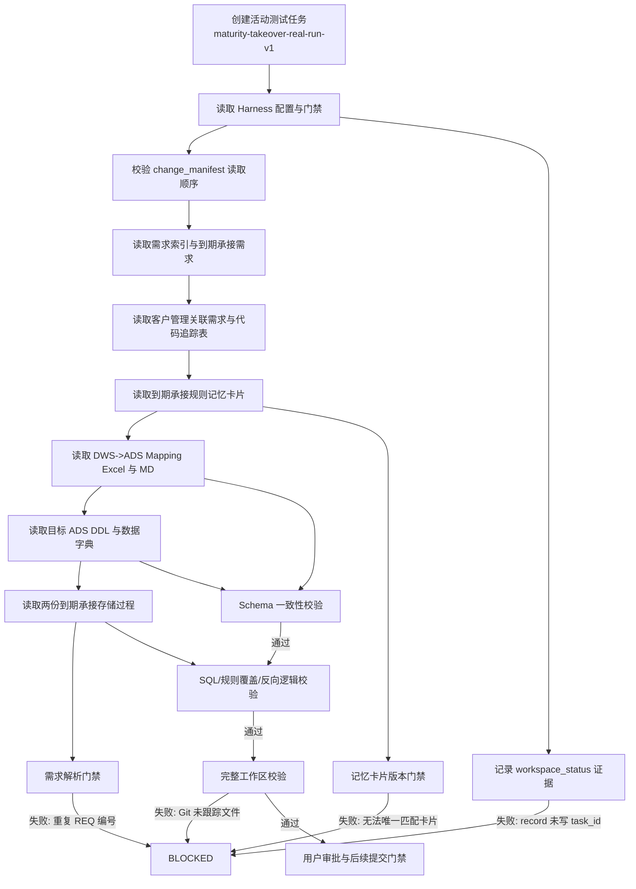

# 到期承接真实需求开发流程测试报告

## 结论

本次测试确实执行了到期承接的真实静态开发链路，未只读取文件。结果为 `BLOCKED`，不能宣称已经完成正式需求开发，也不能进入提交或推送。

通过的业务静态检查：

- DDL、数据字典、Mapping 全量一致性：通过，`differences=0`、`unresolved=0`。
- 到期承接明细存储过程规则覆盖和反向逻辑：通过。
- 已验证保险剔除 `REQ-CUST-007`、通知存款过滤 `REQ-CUST-008`。
- 已验证目标明细 DDL 与 INSERT 字段数量为 25，临时表关系可反向追溯。

阻塞原因：

1. `record` 命令生成通用证据时缺少 `task_id`，导致 `workspace_status` 等阶段证据无法登记。
2. 需求解析器将版本历史、跨模块映射中的重复需求编号当成同一规则重复，`05_经营管理.md` 在 `REQ-CUST-001` 处阻塞；规则记忆卡片也存在版本历史和映射表重复编号。
3. 记忆卡片校验要求目录内唯一卡片，但当前 `requirements` 目录存在 5 张规则记忆卡片，无法从 `05_经营管理.md` 唯一确定到期承接卡片。
4. 全量工作区校验被 Git 一致性检查阻断：本测试任务目录和 4 个既有未跟踪存储过程未纳入 Git。

真实数据库执行：未执行，按用户要求禁止。

Explain 执行计划：未执行，按用户要求禁止。

## 流程图

## 文件读取顺序与结果

| 顺序 | 实际读取文件 | 用途 | 结果/证据 |
|---:|---|---|---|
| 1 | `.harness/config.yaml` | 项目规则 | 通过，E-0001 |
| 2 | `.harness/policies/phase_gates.yaml` | 阶段状态门禁 | 通过，E-0002 |
| 3 | `.harness/policies/required_evidence.yaml` | 阶段证据要求 | 通过，E-0003 |
| 4 | `.harness/policies/allowed_paths.yaml` | 允许修改范围 | 通过，E-0004 |
| 5 | `requirements/需求文档索引.md` | 定位需求来源 | 通过，E-0005 |
| 6 | `requirements/05_经营管理.md` | 到期承接正式需求 | 已读取，解析阻塞，E-0006 |
| 7 | `requirements/03_客户管理.md` | 客户管理关联需求 | 已读取，E-0007 |
| 8 | `requirements/需求-代码映射追踪表.md` | 需求到代码追踪 | 已读取，E-0008 |
| 9 | `requirements/到期承接规则记忆卡片.md` | 版本和业务规则 | 已读取，校验阻塞，E-0009 |
| 10 | `data_assets/mapping/dws_to_ads/ADS应用层数据模型_CRM_ V1.0.xlsx` | Mapping 源数据 | 已读取，E-0010 |
| 11 | `data_assets/mapping/dws_to_ads/dws到ads映射.md` | Mapping 可审计文本 | 已读取，E-0011 |
| 12 | `data_assets/ddl/ads/ads_cust_deadline_rmnd_dtl.sql` | 明细目标结构 | 已读取，E-0012 |
| 13 | `data_assets/ddl/ads/ads_cust_deadline_rmnd_statis.sql` | 统计目标结构 | 已读取，E-0013 |
| 14 | `data_assets/data_dictionary/ads/ads_cust_deadline_rmnd_dtl.md` | 明细字段定义 | 已读取，E-0014 |
| 15 | `data_assets/data_dictionary/ads/ads_cust_deadline_rmnd_statis.md` | 统计字段定义 | 已读取，E-0015 |
| 16 | `data_assets/stored_procedure/dws_to_ads/pro_ads_cust_deadline_rmnd_dtl.sql` | 明细实现逻辑 | 已读取，E-0016 |
| 17 | `data_assets/stored_procedure/dws_to_ads/pro_ads_cust_deadline_rmnd_statis.sql` | 统计实现逻辑 | 已读取，E-0017 |

## 实际执行命令

| 阶段 | 命令 | 实际结果 |
|---|---|---|
| 创建任务 | `python -m scripts.harness create ... --workflow-profile data_warehouse` | 任务创建成功，状态 `CREATED` |
| 读取清单 | `python -m scripts.harness check-manifest .harness/tasks/maturity-takeover-real-run-v1/change_manifest.yaml` | 通过，17 项清单 |
| 需求解析 | `python -m scripts.harness parse-requirement requirements/05_经营管理.md` | 阻塞：重复 `REQ-CUST-001` |
| 记忆卡片校验 | `python -m scripts.harness check-memory-card requirements/05_经营管理.md` | 阻塞：无法唯一匹配卡片 |
| Schema 校验 | `python -m scripts.harness check-schema-consistency maturity-takeover-real-run-v1` | 通过，报告已生成 |
| Schema 门禁 | `python -m scripts.harness check-schema-gate maturity-takeover-real-run-v1` | 通过条件已满足 |
| 逻辑门禁 | `python -m scripts.harness check-logic-gate maturity-takeover-real-run-v1 requirements/到期承接规则记忆卡片.md data_assets/stored_procedure/dws_to_ads/pro_ads_cust_deadline_rmnd_dtl.sql --target-ddl data_assets/ddl/ads/ads_cust_deadline_rmnd_dtl.sql` | 通过 |
| 工作区校验 | `python scripts/run_full_validation.py --report ...` | 失败：Git 一致性检查发现 5 个未跟踪路径 |
| 任务状态 | `python -m scripts.harness block maturity-takeover-real-run-v1 ...` | 正式记录为 `BLOCKED` |

## 后续恢复条件

修复 `record` 证据缺少 `task_id`、支持按目标章节解析需求和显式指定记忆卡片、处理既有未跟踪文件后，重新创建或恢复测试任务，按状态机从阻塞前节点重新执行。未获得用户确认前，不修改 Harness 源码、不清理未跟踪存储过程、不执行提交推送。
