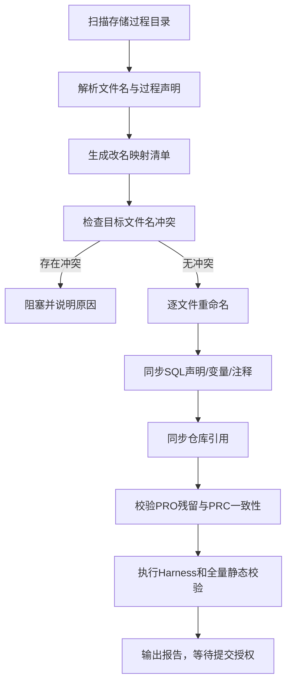

# 存储过程统一 PRC 前缀设计

## 目标

将项目内所有存储过程统一使用 `PRC_` 前缀，消除 `PRO_`、小写 `pro_` 与 `PRC_` 混用，保持文件名、数据库过程名和项目文档引用一致。

## 范围

### 必须修改

- `data_assets/stored_procedure/` 下所有存储过程 SQL 文件名。
- SQL 中 `CREATE OR REPLACE PROCEDURE` 后的过程名。
- 过程内用于记录过程名的变量初始值。
- 存储过程编号、过程名称等注释中的过程名。
- 仓库内指向这些存储过程文件或过程名的需求文档、Mapping、DDL 注释、Harness 证据和脚本引用。

### 不修改

- 表名、字段名、参数名和业务处理逻辑。
- 临时表、DDL、数据字典的业务定义。
- 用户已有的无关未提交修改、删除和未跟踪文件内容。
- 真实数据库执行结果；本次只执行静态检查，不执行数据库和 Explain。

## 命名规则

1. 存储过程文件名统一为 `PRC_<原过程主体名>.sql`，扩展名保持 `.sql`。
2. SQL 过程声明统一为 `CREATE OR REPLACE PROCEDURE PRC_<原过程主体名>`。
3. 过程名变量、过程编号和注释中的过程名与声明保持完全一致。
4. 过程主体名只做前缀规范化，不改变其余字符；例如 `PRO_ADS_CUST_DEADLINE_RMND_DTL` 改为 `PRC_ADS_CUST_DEADLINE_RMND_DTL`。
5. 已经是 `PRC_` 的文件和过程不再改名，仅检查内部一致性。
6. 小写 `pro_` 文件按实际过程声明识别目标名，改为对应大写 `PRC_` 文件名。

## 执行流程

## 未提交文件保护

- 改名前记录 `git status`、当前分支和每个候选文件的 SHA-256。
- 文件重命名使用版本控制可识别的等价改名，不覆盖目标已存在且内容不同的文件。
- 对当前已删除、已修改和未跟踪文件只在其实际存在时处理；不恢复删除文件，不清理未跟踪文件。
- 任何同名冲突、过程声明与文件名不一致、无法判断目标名称的文件都进入阻塞状态，不猜测处理。

## 验证标准

- 存储过程目录中不存在以 `PRO_` 或小写 `pro_` 开头的过程文件。
- 每个过程文件恰好包含一个目标过程声明，文件名主体与过程声明一致。
- 过程名变量和注释中的过程名与声明一致。
- 仓库引用扫描不再出现有效的旧 `PRO_` 过程名引用；历史报告中的原始证据允许保留，但必须标注为历史记录。
- SQL、JSON、YAML、Harness 单元测试和完整工作区静态校验通过。
- 本次改名未改变任何业务 SQL 逻辑或数据资产定义。
- 不执行真实数据库和 Explain。

## 风险与处理

| 风险 | 处理方式 |
|---|---|
| 文件名与过程声明不一致 | 先阻塞，人工确认主体名后再改名 |
| 目标文件已存在 | 比较内容；不同则阻塞，不覆盖 |
| 外部部署脚本仍使用旧过程名 | 仓库内全量扫描并列出未解决引用 |
| 历史证据保留旧名称 | 保留历史证据，当前活动任务引用使用新名称 |
| 工作区已有无关变更 | 只修改授权范围内文件，改名前后对比差异 |

