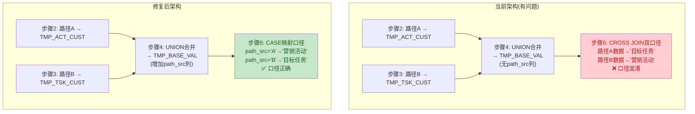

# 指标数据统计存储过程 — 逻辑修复设计文档

> 版本: v1.1.0
> 创建时间: 2026-08-06
> 关联SP: PRC_ADS_STAT_INDX_DATA v1.3.0
> 关联记忆卡片: 指标数据统计_记忆卡片 v1.1

---

## 目录

1. [指标开发数量差异调查](#一指标开发数量差异调查)
2. [问题描述](#二问题描述)
3. [根因分析](#三根因分析)
4. [修复方案](#四修复方案)
5. [实施步骤](#五实施步骤)

---

## 一、指标开发数量差异调查

> 当前口径说明：本文下方“问题描述/根因分析”保留历史审查证据；当前实现状态以本节清单、持久化基准设计和存储过程实际产出为准。未进行 Kingbase 编译或真实数据验证。

### 1.1 完整指标清单（34个）

| 序号 | 指标编码 | 指标名称 | 业务含义 | 源表 | 开发状态 |
|------|----------|----------|----------|------|----------|
| 1 | INDX_0046 | 储蓄存款余额较年初 | 本期AUM - 年初AUM | DWS_CUST_ASSE_LIAB | ✅ 已实现 |
| 2 | INDX_0047 | 储蓄存款余额较基数 | 本期储蓄余额 - DEPO_VALUE_INIT.VALUE_INIT；机构/经理多行基数汇总规则待确认 | DWS_CUST_ASSE_LIAB + DEPO_VALUE_INIT | ⚠️ 需求已更新，待按新来源改造 |
| 3 | INDX_0048 | 储蓄存款余额较上月 | 本期AUM - 上月末AUM | DWS_CUST_ASSE_LIAB | ✅ 已实现 |
| 4 | INDX_0049 | 储蓄存款余额较上季 | 本期AUM - 上季末AUM | DWS_CUST_ASSE_LIAB | ✅ 已实现 |
| 5 | INDX_0050 | 储蓄存款年日均净增额 | 本年年日均 - 上年年日均 | DWS_CUST_ASSE_LIAB BAL_TYPE=4 | ✅ 已实现 |
| 6 | INDX_0051 | 储蓄存款月日均净增额 | 本月月日均 - 上月月日均 | DWS_CUST_ASSE_LIAB BAL_TYPE=2 | ✅ 已实现 |
| 7 | INDX_0052 | 财富及以上层级客户数增量 | 持久化基准LVL<4 → 当前LVL≥4 | DWS_CUST_LVL_INFO + ADS_STAT_INDX_BASELINE_DTL | ✅ 已实现 |
| 8 | INDX_0053 | 贵宾及以上层级客户数增量 | 持久化基准LVL<6 → 当前LVL≥6 | DWS_CUST_LVL_INFO + ADS_STAT_INDX_BASELINE_DTL | ✅ 已实现 |
| 9 | INDX_0054 | 私行及以上层级客户数增量 | 持久化基准LVL<7 → 当前LVL≥7 | DWS_CUST_LVL_INFO + ADS_STAT_INDX_BASELINE_DTL | ✅ 已实现 |
| 10 | INDX_0055 | 个人理财产品年日均净增额 | 当前年日均理财 - 活动/任务开始日前持久化年日均基准 | DWS_CUST_ASSE_LIAB BAL_TYPE=4 + ADS_STAT_INDX_BASELINE_DTL | ✅ 已实现 |
| 11 | INDX_0056 | 个人理财产品月日均净增额 | 当前月日均理财 - 活动/任务开始日前持久化月日均基准 | DWS_CUST_ASSE_LIAB BAL_TYPE=2 + ADS_STAT_INDX_BASELINE_DTL | ✅ 已实现 |
| 12 | INDX_0057 | 个人理财产品销量净增额 | 期间购买-赎回(余额=0=赎回) | DWD_ACCT_FIN | ❌ 占位 |
| 13 | INDX_0058 | 代销理财产品年日均净增额 | 当前(CLOSE_AGEN_FIN_BAL + OPEN_AGEN_FIN_BAL)年日均 - 持久化基准年日均，BAL_TYPE=4 | DWS_CUST_ASSE_LIAB + ADS_STAT_INDX_BASELINE_DTL | ✅ 已实现 |
| 14 | INDX_0059 | 代销理财产品月日均净增额 | 当前(CLOSE_AGEN_FIN_BAL + OPEN_AGEN_FIN_BAL)月日均 - 持久化基准月日均，BAL_TYPE=2 | DWS_CUST_ASSE_LIAB + ADS_STAT_INDX_BASELINE_DTL | ✅ 已实现 |
| 15 | INDX_0060 | 代销理财产品销量净增额 | 期间购买-赎回, CATE_BIG IN('1','2') | DWD_ACCT_FIN | ❌ 占位 |
| 16 | INDX_0061 | 代销保险保费净增额 | 正常保单首期保费合计(期间内) | DWD_ACCT_INSUR | ✅ 已实现 |
| 17 | INDX_0062 | 个人贷款净增额 | 当前贷款余额 - 持久化基准贷款余额 | DWS_CUST_ASSE_LIAB BAL_TYPE=1 + ADS_STAT_INDX_BASELINE_DTL | ✅ 已实现 |
| 18 | INDX_0063 | 临界客户净增 | 当前临界客户数 - 持久化基准临界客户状态 | DWS_CUST_ASSE_LIAB BAL_TYPE=2 + ADS_STAT_INDX_BASELINE_DTL | ✅ 已实现 |
| 19 | INDX_0064 | 代发薪客户净增 | 活动/任务客户范围内 [开始日,跑批日] 新标记为代发薪客户数（标签 IS_NOT_SALRY_PAYROL_BK='1'，基数表按活动/任务编号隔离，FRST_MARK_DATE ∈ [开始日,跑批日]） | ADS_CRM_R_CUST_LABLE + ADS_CRM_R_SALRY_PAYROL_BASE | ✅ 已实现 |
| 20 | INDX_0065 | 代销业务收入 | 期间[开始日,跑批日]理财SUM(FIN_AMT)(CATE_BIG IN('1','2'),ISSU_DATE∈期间)+保险SUM(INSUR_AMT)(POLICY_STATE='1',TX_DATE∈期间)；暂不含贵金属 | DWD_ACCT_FIN + DWD_ACCT_INSUR | ✅ 已实现 |
| 21 | INDX_0066 | 个贷不良贷款率 | 不良余额(CATE_5LVL 3/4/5) / 总贷款余额 | DWD_ACCT_LOAN | ⏸ 已停产 |
| 22 | INDX_0067 | 手机银行月活跃客户数 | 当月≥1次成功登录 | mbk_cust_log_login + mbk_cust_info | ✅ 已实现 |
| 23 | INDX_0068 | 支付结算年度价值商户数 | 同时满足AUM/活期+条码收单的商户数 | DWS_CUST_ASSE_LIAB + uepp | ❌ 排除 |
| 24 | INDX_0069 | 二维码收款个人活跃商户结算存款留存率 | 年日均存款/年累计交易量 | uepp + DWD_ACCT_DEPO | ❌ 排除 |
| 25 | INDX_0070 | 银行卡三方支付绑卡 | 【v4.5后续实现】活动/任务客户范围内首次绑定微信/支付宝/云闪付的客户数，按(CUST_ID,PERSN_LEGAL_BK_CODE)去重 | ECPP_E_TXN_SIGN + CBS_KCDA_PZJCXX | ✅ 已开发（现行口径） |
| 26 | INDX_0071 | 银行卡三方支付绑卡率 | 绑卡数/总客户数×100 | +DWD_CUST_INDV_INFO | ⏸ 已停产 |
| 27 | INDX_0072 | 活跃卡数 | 近180天有主动动账交易的卡数 | DWD_TX_ASET | ⏸ 已停产 |
| 28 | INDX_0073 | 手机银行客户新增个人客户数 | — | 综合报表平台 | ❌ 排除 |
| 29 | INDX_0074 | 手机银行交易金额 | — | 综合报表平台 | ❌ 排除 |
| 30 | INDX_0075 | 手机银行交易笔数 | — | 综合报表平台 | ❌ 排除 |
| 31 | INDX_0076 | 一码付收款户数 | — | 综合报表平台 | ❌ 排除 |
| 32 | INDX_0077 | 一码付收款新增商户数 | — | 综合报表平台 | ❌ 排除 |
| 33 | INDX_0078 | 一码付收款交易金额 | — | 综合报表平台 | ❌ 排除 |
| 34 | INDX_0079 | 一码付收款交易笔数 | — | 综合报表平台 | ❌ 排除 |

### 1.2 开发状态汇总

| 状态 | 数量 | 占比 | 指标编码范围 |
|------|------|------|-------------|
| ✅ 正常产出 | 18 | 52.9% | 0046-0056, 0058-0059, 0061-0064, 0067 |
| ⏸ 已停产/不产出 | 0 | 0% | — |
| ❌ 占位(0值) | 3 | 8.8% | 0057, 0060, 0065 |
| ❌ 排除(本期不处理) | 9 | 26.5% | 0068-0069, 0073-0079 |

### 1.3 未开发指标详细分析

#### 1.3.1 占位指标（3个）— 阻塞原因及优先级

| 指标 | 业务含义 | 阻塞原因 | 优先级 | 解决方案 |
|------|----------|----------|--------|----------|
| 0057 | 个人理财产品销量净增额 | DWD_ACCT_FIN 无明确的购买/赎回标识字段，当前仅有FIN_AMT(余额)和CFM_AMT(交易确认金额) | P1 | 用CFM_AMT按TX_DATE范围SUM作为销量；或用FIN_AMT差值(期末-期初) |
| 0060 | 代销理财产品销量净增额 | 同0057 + 需增加PRDKT_CATE_BIG IN('1','2')过滤 | P2 | 0057方案 + 代销过滤条件 |
| 0065 | 代销业务收入 | ~~保险代销收入(手续费)和理财代销收入(手续费)的字段未在DWD_ACCT_INSUR/DWD_ACCT_FIN中定义~~ 已解决 | P2 | 2026-08-24 用户定案：理财SUM(FIN_AMT)+保险SUM(INSUR_AMT)替代手续费口径，暂不含贵金属 |

> 注（v1.9）：0064 原列入占位并阻塞于 `DWD_CUST_SIGN_CTRAKT.CTRAKT_TYP` 6 种子类型值域（Q4 v1.3.1）。2026-08-24 口径先改为直连 ECIF/CBS（v1.8），同日按用户定案再改为**标签表口径**（v1.9）：`ADS_CRM_R_CUST_LABLE.IS_NOT_SALRY_PAYROL_BK='1'` + 基数表 `ADS_CRM_R_SALRY_PAYROL_BASE` 按活动/任务编号隔离（基数'19000101'/新增=跑批日），已在 plan_006 7.0（基数刷新）+ 7.17/7.18（汇总）实现，故从占位移除。

> 注（v2.0）：0065 原阻塞于手续费字段缺失。2026-08-24 用户定案改用代理口径：理财 `DWD_ACCT_FIN.FIN_AMT`（`PRDKT_CATE_BIG IN('1','2')`，`ISSU_DATE∈[开始日,跑批日]`）+ 保险 `DWD_ACCT_INSUR.INSUR_AMT`（`POLICY_STATE='1'`，`TX_DATE∈[开始日,跑批日]`），合并 SUM；暂不含贵金属。已在 plan_006 7.19/7.20 实现（v4.8），故从占位移除。

#### 1.3.2 排除指标（9个）— 排除原因

| 指标范围 | 数量 | 排除原因 |
|----------|------|----------|
| 0068-0069 | 2 | 依赖uepp支付结算系统数据，uepp_pay_mct_settle_account DDL尚未创建，数据关联规则虽已确认(cust_no=CUST_ID)但表结构未落地 |
| 0073-0079 | 7 | 综合报表平台指标，本期不纳入数据仓库处理范围 |

#### 1.3.3 v2.0.3未编码指标（4个）

| 指标名称 | v2.0.3分类 | 状态 |
|----------|-----------|------|
| 新客交叉销售 | 客户 | 待确认，无INDX编码 |
| 二维码收款个人活跃商户AUM留存率 | AUM | 待确认，无INDX编码 |
| 新增客户数 | 客户 | 待确认，无INDX编码 |
| 借记卡新开净增量 | 银行卡 | 待确认，无INDX编码 |

---

## 二、问题描述

### 2.1 问题总览

| 编号 | 严重级别 | 问题概要 | 影响指标数 |
|------|---------|----------|-----------|
| P0-01 | 🔴 严重 | CROSS JOIN口径混淆，路径A/B数据互相串口径 | 11个(0046-0056,0062,0063) |
| P0-02 | 🔴 严重 | V_YAR_PREV_END计算"去年同月"而非"上年末" | 2个(0050,0055) |
| P0-03 | 🔴 严重 | 0066不良贷款率未过滤已结清/核销贷款 | 1个(0066) |
| P1-01 | 🟠 中等 | 路径B机构对象JOIN缺少data_date过滤 | 全部路径B指标 |
| P1-02 | 🟠 中等 | 0052-0054客户等级用字符串比较 | 3个(0052-0054) |
| P1-03 | 🟠 中等 | 0072未使用JIOYCFFS主动动账标识 | 1个(0072) |
| P1-04 | 🟠 中等 | 步骤2a三表JOIN无PK保护，可能产生笛卡尔积 | 全部路径A指标 |
| P2-01 | 🟡 低 | 0063"净增"语义与实现不匹配 | 1个(0063) |
| P2-02 | 🟡 低 | 6t占位块UNION vs UNION ALL不一致 | 6个占位指标 |

### 2.2 P0-01: CROSS JOIN口径混淆

**错误现象**：步骤4将路径A（TMP_STAT_INDX_ACT_CUST）和路径B（TMP_STAT_INDX_TSK_CUST）通过UNION合并到TMP_STAT_INDX_BASE_VAL，未标记数据来源路径。步骤6a~6l对BASE_VAL使用CROSS JOIN展开双口径：

```sql
-- 当前代码(L444)
FROM TMP_STAT_INDX_BASE_VAL bv
CROSS JOIN (SELECT '营销活动' AS calib UNION ALL SELECT '目标任务' AS calib) t
```

**复现步骤**：

```
输入: V_SYSDAT='20260806'
  路径A: 活动 ACT_001, 客户 CUST_A, 经理 MGR_001
  路径B: 任务 TSK_001, 客户 CUST_B, 机构 ORG_001

步骤4 UNION后 TMP_STAT_INDX_BASE_VAL:
  (data_blng='MGR_MGR_001', statis_dim='ACT_001', cust_id='CUST_A')  -- 来自路径A
  (data_blng='ORG_ORG_001',   statis_dim='TSK_001', cust_id='CUST_B')  -- 来自路径B

步骤6a CROSS JOIN后 TMP_STAT_INDX_AGGR:
  (data_blng='MGR_MGR_001', statis_dim='ACT_001', statis_calib='营销活动', ...)  -- ✅ 正确
  (data_blng='MGR_MGR_001', statis_dim='ACT_001', statis_calib='目标任务', ...)  -- ❌ 错误: 路径A数据被标记为'目标任务'
  (data_blng='ORG_ORG_001', statis_dim='TSK_001', statis_calib='营销活动', ...)  -- ❌ 错误: 路径B数据被标记为'营销活动'
  (data_blng='ORG_ORG_001', statis_dim='TSK_001', statis_calib='目标任务', ...)  -- ✅ 正确
```

**影响范围**：6a~6l（0046~0056, 0062）, 6m（0063） — 共12个指标。6n~6s（0061/0066/0067/0070/0071/0072）同样存在此问题，因为它们直接UNION ALL ACT_CUST和TSK_CUST后CROSS JOIN。

### 2.3 P0-02: V_YAR_PREV_END计算错误

**错误现象**：

```sql
-- 当前代码(L75)
V_YAR_PREV_END := TO_CHAR(TO_DATE(V_MTH_END, 'YYYYMMDD') - INTERVAL '1' YEAR, 'YYYYMMDD');
```

| 变量 | 声明语义 | V_SYSDAT='20260806'时的实际值 | 期望值 |
|------|----------|-------------------------------|--------|
| V_MTH_END | 上月末 | 20260731 | — |
| V_YAR_PREV_END | 上年末(上年日均取数用) | **20250731** | **20251231** |

**影响范围**：步骤4的yr_last JOIN取`data_date=V_YAR_PREV_END AND bal_type='4'`，若DWS表按年末存储年日均数据，则取不到任何数据，0050（年日均净增）和0055（理财年日均净增）的上年日均值为0。

### 2.4 P0-03: 0066不良贷款率未过滤贷款状态

**错误现象**：

```sql
-- 当前代码(L631)
INNER JOIN DWD_ACCT_LOAN loan ON loan.cust_id = cu.cust_id
-- 无 acct_state 过滤
```

已结清/核销的贷款也被纳入计算，导致不良率分母虚高（已结清贷款余额为0不影响SUM但增加行数），或分子虚高（若已核销贷款CATE_5LVL仍为不良分类）。

### 2.5 P1-01: 路径B机构对象缺少data_date过滤

**错误现象**：

```sql
-- 当前代码(L186)
INNER JOIN DWS_CUST_LVL_INFO lv ON lv.org_id = it.rsv_obj_id
-- 无 data_date 过滤
```

DWS_CUST_LVL_INFO是快照表（每天一份），同一客户在不同日期有多条等级记录，JOIN不限定日期会导致客户被重复计数。

### 2.6 P1-04: 步骤2a三表JOIN笛卡尔积风险

**错误现象**：

```sql
FROM DWD_MKT_ACT_INFO a
INNER JOIN DWD_MKT_ACT_TARGT t ON t.mkt_act_id = a.mkt_act_id
INNER JOIN DWD_MKT_TSK_INFO ts ON ts.mkt_act_id = a.mkt_act_id
```

DWD_MKT_ACT_TARGT和DWD_MKT_TSK_INFO均无DDL文件、无PK约束。若同一(mkt_act_id, indx_id)或(mkt_act_id, cust_id)存在重复行，会产生M×K笛卡尔积膨胀。

---

## 三、根因分析

### 3.1 P0-01根因：UNION合并丢失路径标记



**技术原因**：CROSS JOIN的设计初衷是让同一组基表数据同时产出两个口径的结果行，但前提是基表数据本身是口径无关的。本场景中，路径A和路径B的客户集合完全不同（路径A是活动分配的客户，路径B是任务接收的客户），CROSS JOIN会导致每个客户的数据被错误地标记为另一个口径。

### 3.2 P0-02根因：日期运算逻辑错误

**技术原因**：`INTERVAL '1' YEAR` 是对日期值做日历运算，`20260731 - 1年 = 20250731`。但业务需要的"上年末"是固定为上年12月31日，与V_MTH_END的月日无关。

### 3.3 P0-03根因：缺少业务过滤条件

**技术原因**：DWD_ACCT_LOAN.DDL中`ACCT_STATE`字段记录账户状态（如'正常'/'结清'/'核销'等），但SP编写时未加入状态过滤。这是需求分析阶段遗漏了贷款有效性判定条件。

---

## 四、修复方案

### 4.1 修复项总表

| 编号 | 修复项 | 影响文件 | 修复策略 |
|------|--------|----------|----------|
| P0-01 | CROSS JOIN口径混淆 | SP + TMP DDL | BASE_VAL增加path_src列，CROSS JOIN改为CASE映射 |
| P0-02 | V_YAR_PREV_END计算错误 | SP | 改为固定拼接上年12月31日 |
| P0-03 | 0066未过滤贷款状态 | SP | 增加acct_state过滤条件 |
| P1-01 | 路径B缺少data_date | SP | DWS_CUST_LVL_INFO JOIN增加data_date=V_SYSDAT |
| P1-02 | 客户等级字符串比较 | SP | CAST为NUMBER后比较 |
| P1-03 | 0072未用JIOYCFFS | SP | 增加JIOYCFFS='0'过滤 |
| P1-04 | 步骤2a笛卡尔积风险 | SP | 子查询加DISTINCT去重 |
| P2-01 | 0063语义不匹配 | SP(注释) | 注释标注"当期临界客户数"而非"净增" |
| P2-02 | UNION不一致 | SP | 6t统一为UNION ALL |

### 4.2 P0-01详细修复方案：路径A/路径B口径分离

#### 4.2.0 持久化上期基准设计

新增表 `ADS_STAT_INDX_BASELINE_DTL`，将活动/任务开始日前客户明细的上期值冻结，当前适用于 `0052~0056、0058~0059、0062~0063`。

业务主键为 `STATIS_CALIB + STATIS_DIM + INDX_CODE + DATA_BLNG + CUST_ID + PERSN_LEGAL_BK_CODE`，基准字段包括客户等级、贷款余额、月日均AUM、年/月日均理财及年/月日均代销理财。

- 正常跑批在开始日前一天读取历史快照并落库。
- 前一天未成功时，活动期间允许补建，但只能读取开始日前一天的历史快照。
- `BASE_DATA_DATE` 固定为开始日前一天；`BASE_RUN_DATE` 记录实际生成或补建日期。
- 同一业务主键已有基准时不得覆盖，避免源表删除或每日重跑导致上期值丢失或漂移。
- `0058/0059` 当前值使用 `DWS_CUST_ASSE_LIAB.CLOSE_AGEN_FIN_BAL + OPEN_AGEN_FIN_BAL`，分别按 `BAL_TYPE='4'` 年日均和 `BAL_TYPE='2'` 月日均取值。

`0047` 不使用该客户基准表，改从 `DEPO_VALUE_INIT(ORG_ID, PERSN_LEGAL_BK_CODE, MNGR_POST_ID, VALUE_INIT)`取基数；同一机构多个经理基数的机构层汇总规则尚未确认，暂不得将其写成已完成实现。

#### 4.2.1 TMP DDL修改

**文件**: `tmp_pro_ads_stat_indx_data.ddl`

TMP_STAT_INDX_BASE_VAL 增加path_src列：

```sql
-- 修改前
CREATE TABLE IF NOT EXISTS TMP_STAT_INDX_BASE_VAL (
    data_blng  VARCHAR(100) NOT NULL,
    statis_dim VARCHAR(100) NOT NULL,
    cust_id    VARCHAR(20)  NOT NULL,
    ...
    PRIMARY KEY (data_blng, statis_dim, cust_id)
);

-- 修改后
CREATE TABLE IF NOT EXISTS TMP_STAT_INDX_BASE_VAL (
    data_blng  VARCHAR(100) NOT NULL,
    statis_dim VARCHAR(100) NOT NULL,
    cust_id    VARCHAR(20)  NOT NULL,
    path_src   VARCHAR(1)  NOT NULL,    -- 路径来源(A=营销活动/B=目标任务)
    ...
    PRIMARY KEY (data_blng, statis_dim, cust_id, path_src)
);
```

TMP_STAT_INDX_LVL_CHG 和 TMP_STAT_INDX_CRITICAL 同样增加path_src列。

#### 4.2.2 SP步骤4修改

```sql
-- 修改前(L301-304)
FROM (
    SELECT mkt_act_id AS statis_dim, data_blng, cust_id FROM TMP_STAT_INDX_ACT_CUST
    UNION
    SELECT tsk_id     AS statis_dim, data_blng, cust_id FROM TMP_STAT_INDX_TSK_CUST
) cu

-- 修改后
FROM (
    SELECT mkt_act_id AS statis_dim, data_blng, cust_id, 'A' AS path_src FROM TMP_STAT_INDX_ACT_CUST
    UNION ALL
    SELECT tsk_id     AS statis_dim, data_blng, cust_id, 'B' AS path_src FROM TMP_STAT_INDX_TSK_CUST
) cu
```

> 注意：UNION改为UNION ALL，因为路径A和路径B的statis_dim值域不同(mkt_act_id ≠ tsk_id)，不可能重复，无需去重开销。

#### 4.2.3 SP步骤6修改 — CROSS JOIN改为CASE映射

**修改前(以6a为例)**：

```sql
INSERT INTO TMP_STAT_INDX_AGGR (...)
SELECT V_SYSDAT, bv.data_blng, bv.statis_dim, t.calib, 'INDX_0046',
       SUM(bv.curnt_aum - bv.yr_last_aum), 0, '9999'
FROM TMP_STAT_INDX_BASE_VAL bv
CROSS JOIN (SELECT '营销活动' AS calib UNION ALL SELECT '目标任务' AS calib) t
GROUP BY bv.data_blng, bv.statis_dim, t.calib;
```

**修改后**：

```sql
INSERT INTO TMP_STAT_INDX_AGGR (...)
SELECT V_SYSDAT, bv.data_blng, bv.statis_dim,
       CASE WHEN bv.path_src = 'A' THEN '营销活动' ELSE '目标任务' END AS calib,
       'INDX_0046',
       SUM(bv.curnt_aum - bv.yr_last_aum), 0, '9999'
FROM TMP_STAT_INDX_BASE_VAL bv
GROUP BY bv.data_blng, bv.statis_dim, CASE WHEN bv.path_src = 'A' THEN '营销活动' ELSE '目标任务' END;
```

**涉及修改的INSERT块**：

| 块 | 指标 | 修改内容 |
|----|------|----------|
| 6a | 0046 | 删CROSS JOIN，改CASE映射 |
| 6b | 0047 | 本就仅'目标任务'，改WHERE bv.path_src='B' |
| 6c | 0048 | 删CROSS JOIN，改CASE映射 |
| 6d | 0049 | 删CROSS JOIN，改CASE映射 |
| 6e | 0050 | 删CROSS JOIN，改CASE映射 |
| 6f | 0051 | 删CROSS JOIN，改CASE映射 |
| 6g | 0052 | 删CROSS JOIN，改CASE映射 |
| 6h | 0053 | 删CROSS JOIN，改CASE映射 |
| 6i | 0054 | 删CROSS JOIN，改CASE映射 |
| 6j | 0055 | 删CROSS JOIN，改CASE映射 |
| 6k | 0056 | 删CROSS JOIN，改CASE映射 |
| 6l | 0062 | 删CROSS JOIN，改CASE映射 |
| 6m | 0063 | 删CROSS JOIN，改CASE映射 |

**6n~6s(0061/0066/0067/0070/0071/0072)修改** — 这些块直接UNION ALL ACT_CUST和TSK_CUST，同样改为带path_src标记：

```sql
-- 修改前(以6n为例)
FROM (
    SELECT data_blng, mkt_act_id AS statis_dim, cust_id, act_bgn_date FROM TMP_STAT_INDX_ACT_CUST
    UNION ALL
    SELECT data_blng, tsk_id     AS statis_dim, cust_id, tsk_bgn_date FROM TMP_STAT_INDX_TSK_CUST
) cu
CROSS JOIN (SELECT '营销活动' AS calib UNION ALL SELECT '目标任务' AS calib) t

-- 修改后
FROM (
    SELECT data_blng, mkt_act_id AS statis_dim, cust_id, act_bgn_date, 'A' AS path_src FROM TMP_STAT_INDX_ACT_CUST
    UNION ALL
    SELECT data_blng, tsk_id     AS statis_dim, cust_id, tsk_bgn_date, 'B' AS path_src FROM TMP_STAT_INDX_TSK_CUST
) cu
-- 删除CROSS JOIN，SELECT中用CASE映射
```

### 4.3 P0-02详细修复方案

```sql
-- 修改前(L75)
V_YAR_PREV_END := TO_CHAR(TO_DATE(V_MTH_END, 'YYYYMMDD') - INTERVAL '1' YEAR, 'YYYYMMDD');

-- 修改后
V_YAR_PREV_END := (SUBSTR(V_SYSDAT, 1, 4) - 1) || '1231'; -- 上年末=上年12月31日
```

### 4.4 P0-03详细修复方案

```sql
-- 修改前(L631)
INNER JOIN DWD_ACCT_LOAN loan ON loan.cust_id = cu.cust_id

-- 修改后
INNER JOIN DWD_ACCT_LOAN loan ON loan.cust_id = cu.cust_id
  AND loan.acct_state NOT IN ('结清', '核销', '关闭')  -- 仅统计存续贷款
```

> 待确认：DWD_ACCT_LOAN.ACCT_STATE的具体值域，上述值仅为推测，需与业务确认。

### 4.5 P1-01详细修复方案

```sql
-- 修改前(L186)
INNER JOIN DWS_CUST_LVL_INFO lv ON lv.org_id = it.rsv_obj_id

-- 修改后
INNER JOIN DWS_CUST_LVL_INFO lv ON lv.org_id = it.rsv_obj_id
  AND lv.data_date = V_SYSDAT  -- 仅取当日客户等级快照
```

### 4.6 P1-02详细修复方案

```sql
-- 修改前(L395-403)
CASE WHEN NVL(lv_term_last.cust_lvl, '0') < '4'
      AND NVL(lv_curnt.cust_lvl, '0') >= '4'
     THEN '1' ELSE '0' END

-- 修改后 — 使用TO_NUMBER确保数值比较
CASE WHEN TO_NUMBER(NVL(lv_term_last.cust_lvl, '0')) < 4
      AND TO_NUMBER(NVL(lv_curnt.cust_lvl, '0')) >= 4
     THEN '1' ELSE '0' END
```

### 4.7 P1-03详细修复方案

```sql
-- 修改前(L673-674)
INNER JOIN DWD_TX_ASET tx ON tx.cust_id = cu.cust_id
  AND tx.tx_date >= TO_CHAR(TO_DATE(V_SYSDAT, 'YYYYMMDD') - 180, 'YYYYMMDD')

-- 修改后
INNER JOIN DWD_TX_ASET tx ON tx.cust_id = cu.cust_id
  AND tx.tx_date >= TO_CHAR(TO_DATE(V_SYSDAT, 'YYYYMMDD') - 180, 'YYYYMMDD')
  AND tx.jioycffs = '0'  -- 仅主动动账
```

### 4.8 P1-04详细修复方案

```sql
-- 修改前(L112-113)
INNER JOIN DWD_MKT_ACT_TARGT t ON t.mkt_act_id = a.mkt_act_id
INNER JOIN DWD_MKT_TSK_INFO ts ON ts.mkt_act_id = a.mkt_act_id

-- 修改后 — 子查询去重保护
INNER JOIN (SELECT DISTINCT mkt_act_id, indx_id FROM DWD_MKT_ACT_TARGT) t ON t.mkt_act_id = a.mkt_act_id
INNER JOIN (SELECT DISTINCT mkt_act_id, cust_id, mkt_persn, mkt_persn_org FROM DWD_MKT_TSK_INFO) ts ON ts.mkt_act_id = a.mkt_act_id
```

---

## 五、实施步骤

### 5.1 开发原则

**路径A逻辑优先开发，完成后再启动路径B逻辑。**

### 5.2 分阶段实施计划

#### 阶段1: 基础修复（P0级，阻塞性问题）

| 步骤 | 修复项 | 文件 | 具体操作 |
|------|--------|------|----------|
| 1.1 | P0-02: V_YAR_PREV_END | SP L75 | 改为`(SUBSTR(V_SYSDAT,1,4)-1)||'1231'` |
| 1.2 | P0-03: 0066贷款状态过滤 | SP 6o块 | 增加`acct_state NOT IN(...)` |
| 1.3 | P0-01: TMP DDL增加path_src | TMP DDL | BASE_VAL/LVL_CHG/CRITICAL增加path_src列+PK调整 |
| 1.4 | P0-01: SP步骤4增加path_src | SP步骤4 | UNION改为UNION ALL + 增加'A'/'B'标记 |
| 1.5 | P0-01: SP步骤5增加path_src | SP步骤5 | LVL_CHG和CRITICAL继承path_src |
| 1.6 | P0-01: SP步骤6a~6m改CASE映射 | SP 6a~6m | 删除CROSS JOIN，改CASE WHEN path_src |
| 1.7 | P0-01: SP步骤6n~6s改CASE映射 | SP 6n~6s | UNION ALL增加path_src，删CROSS JOIN |
| 1.8 | P0-01: SP步骤6t改CASE映射 | SP 6t | UNION ALL增加path_src，删CROSS JOIN |

#### 阶段2: 中等修复（P1级）

| 步骤 | 修复项 | 文件 | 具体操作 |
|------|--------|------|----------|
| 2.1 | P1-01: data_date过滤 | SP L186 | DWS_CUST_LVL_INFO JOIN增加data_date=V_SYSDAT |
| 2.2 | P1-02: 等级数值比较 | SP步骤5a | CUST_LVL比较改TO_NUMBER |
| 2.3 | P1-03: JIOYCFFS过滤 | SP 6q块 | 增加`tx.jioycffs='0'` |
| 2.4 | P1-04: 步骤2a去重保护 | SP L112-113 | 子查询加DISTINCT |

#### 阶段3: 低优先级修复（P2级）

| 步骤 | 修复项 | 文件 | 具体操作 |
|------|--------|------|----------|
| 3.1 | P2-01: 0063注释修正 | SP 6m块 | 注释标注"当期临界客户数" |
| 3.2 | P2-02: UNION一致性 | SP 6t块 | UNION改UNION ALL |

#### 阶段4: 路径A/路径B独立验证

| 步骤 | 验证项 | 方法 |
|------|--------|------|
| 4.1 | 路径A单独验证 | 注释掉步骤3(路径B)，仅运行步骤2+4+5+6+7，验证STATIS_CALIB全部为'营销活动' |
| 4.2 | 路径B单独验证 | 注释掉步骤2(路径A)，仅运行步骤3+4+5+6+7，验证STATIS_CALIB全部为'目标任务' |
| 4.3 | 双路径联合验证 | 恢复全部步骤，验证无口径串扰 |

### 5.3 修改文件清单

| 文件 | 修改内容 | 阶段 |
|------|----------|------|
| `data_assets/ddl/tmp/tmp_pro_ads_stat_indx_data.ddl` | BASE_VAL/LVL_CHG/CRITICAL增加path_src列 | 1.3 |
| `data_assets/stored_procedure/dws_to_ads/PRC_ADS_STAT_INDX_DATA.sql` | 步骤1日期修复+步骤2去重+步骤4路径标记+步骤5继承+步骤6全量改写 | 1.1~1.8 + 2.1~2.4 |
| `requirements/指标数据统计_记忆卡片.md` | 版本更新至v1.8.0 | 全部完成后 |

---

*文档版本: v1.0.0 | 创建时间: 2026-08-06*
